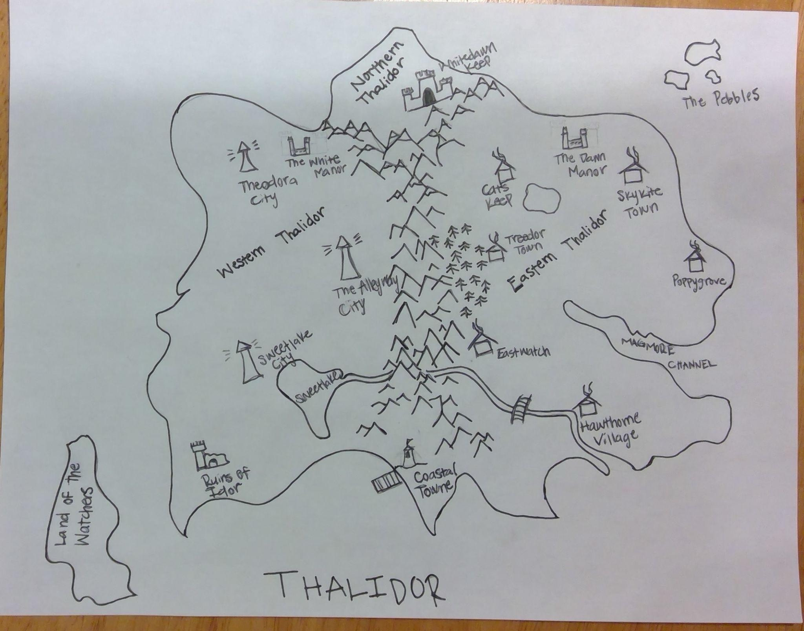

# Geography

## Visited Places

* [Hawthorne](./Hawthorne.md)
* [Eastwatch](./Eastwatch.md)
* [Forest with a Name](./Forest%20with%20a%20Name.md)
* [Water Cave](./Water%20Cave.md)
* [Seaside](./Seaside.md)
* [Coastal Towne](./Coastal%20Town.md)

> See [Government](../Government/README.md) for info about the region