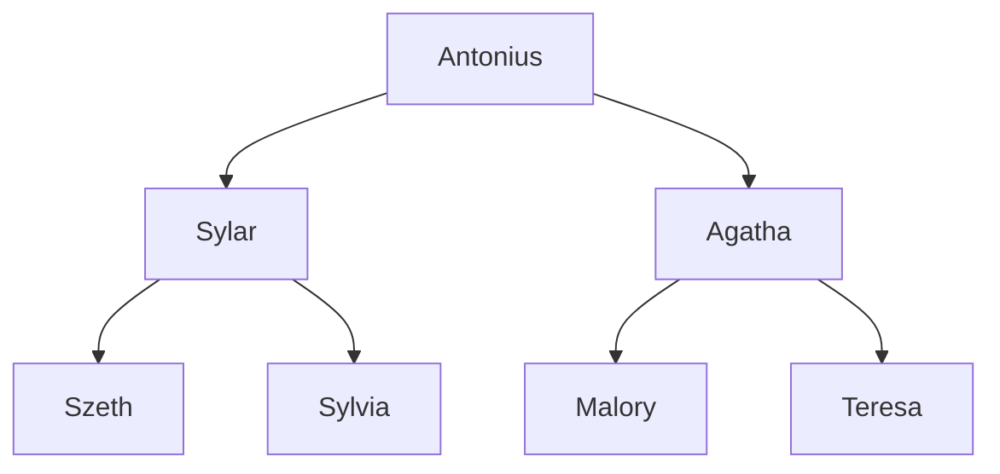

# Thalidor

## Political System
* Thalidor is an Absolute Monarchy, meaning that the ruling sovereign is not limited by a constitution, parliament, or congressional power
* However, Thalidor's monarchy has adopted a unique progression of power due to the needs and limitations of its landscape.

## Northern Thalidor
The contry of Thalidor is run by the King or Queen, the oldest member of the royal bloodline, the Whitedawns. Before ascending to the High throne, each Heir is required to have at least two children. Once the King or Queen is crowned, they travel to and rule from Northern Thalidor, the official seat of power. Most monarchs are rarely, if ever, seen again.

## The Heirs
Due to the [mountain range](../Geography/Mountains.md) that bisects the kingdom, [Eastern](#the-east) and [Western](#the-west) Thalidor function almost as two separate kingdoms, lead by the Heirs. When a monarch dies, one of the Heirs takes the throne. Any members of the royal family who want to assert a legitimate clame to the throne must have two children before being considered. Once a new monarch is elevated to the throne, their children become the Heirs, each ruling either the [East](#the-east) or [West](#the-west).

## Current Royal Line

## The Chosen
* Over the generations, the royal bloodline has prioritized strength and dominance as its most valued traits.
* When a monarch dies, it falls to the children of the Heirs to determine which side of the bloodline ascends.
* The children hold a competition, details unknown to the general public, and the winners become the new Heirs. Their Whitedawn parent ascends to become King or Queen.
* The losing branch, children and Heir, is put to death in order to maintain the cycle and prevent an alternative claim to the throne in the future.
* If an Heir has more than two children, they choose the two they would like to participate in the competition. The rest are rendered infertile and reduced to support roles

## Implications
* This system means that each generation of siblings, if they ascend to Heirs, must shift from allies to enemies.
* Either the [East](#the-east) or the [West](#the-west) receives a new ruler from the opposite side of the kingdom with each generation. When the ruler comes from the other side of Thalidor, they typically know very little about their new duties; the central mountain range makes travel between the two sides very difficult, but not impossible. Additionally, the competitive natureof the competition breeds distrust and secrecy.

## Common Folk
* As dramatic as the royal politics sound, life for the little people goes on. But many people are unhappy with the monarchy, as their focus rarely turns to the people's needs. In a life of near constant calculation and plotting, a farmer's crops or a village's need for a dam rarely takes priority.
* There are many factions with many opinions on how to improve the kingdom and government. Some believe it best to support the branch of the family directly over their side to maintain continuity, others believe the competition should cease and one branch should take over indefinitely. Still others believe the monarchy should be overthrown in favor of a democracy, or that the two kingdoms should split, their needs too unique and difficult to leave to one set of rulers.

## The East
The eastern side of Thalidor has long maintained its traditional values. The people work hard, little villages aplenty to provide and supply goods for trade. Farm land is highly valued, and homemaking skills are passed from generation to generation. Sewing, cooking, cobbling, blacksmithing, healing, etc. are encouraged in both men and women.

While food and trade thrives in this side of the kingdom, in recent years, a plague has slowly terrorized the land. Both magical healers and trained physicians have found little to treat the [bloodless death](../Conditions.md#bloodless-death). Traditions of the past have done little to combat modern challenges. 

## The West
The people of western Thalidor believe the East to be stuck in the past. A few large cities now dominate the land, people flocking to these capitals of innovation. The newest magical technology is all the rage, testing the boundaries of the past. The people clamor for more efficient ways to improve their lives, from flameless light that never burns out, to teleportation devices that can transport a person ten miles in any direction. Take caution, however, as one is just as likely to purchase a dupe or an untested device as they are the real thing.

This technological craze has taken such priority with the people, without proper structure or planning, that food and basic supplies have become scarce, driving prices high and leaving many begging on the streets.
